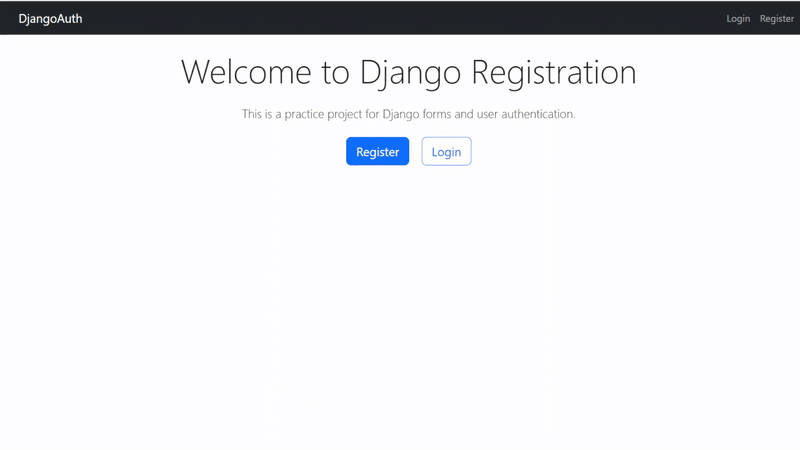

# Django Registration Form Project



A complete Django web application demonstrating user registration, authentication, and profile management with Bootstrap 5 styling.

## 🚀 Features

- **User Registration** - Custom registration form with validation
- **User Authentication** - Login and logout functionality
- **Profile Management** - Update user profile information
- **Responsive Design** - Bootstrap 5 styling throughout
- **Form Validation** - Client and server-side validation
- **Security** - CSRF protection, secure password handling
- **User Feedback** - Success/error messages with alerts

## 🛠️ Technologies Used

- **Backend**: Django 4.2+
- **Frontend**: Bootstrap 5, HTML5, CSS3
- **Forms**: Django Forms + Crispy Forms
- **Database**: SQLite (default)
- **Authentication**: Django built-in auth system

## 📋 Prerequisites

- Python 3.8+
- pip (Python package manager)

## ⚡ Quick Start

### 1. Clone and Setup

```bash
# Create project directory
mkdir django-registration-project
cd django-registration-project

# Create virtual environment
python -m venv venv

# Activate virtual environment
# Windows:
venv\Scripts\activate
# Mac/Linux:
source venv/bin/activate

# Install dependencies
pip install django django-crispy-forms crispy-bootstrap5
```

### 2. Project Setup

```bash
# Create Django project
django-admin startproject registration_project .

# Create users app
python manage.py startapp users

# Run migrations
python manage.py makemigrations
python manage.py migrate

# Create superuser (optional)
python manage.py createsuperuser
```

### 3. Configuration

Update `registration_project/settings.py`:

```python
INSTALLED_APPS = [
    # ... default apps ...
    'users',
    'crispy_forms',
    'crispy_bootstrap5',
]

CRISPY_ALLOWED_TEMPLATE_PACKS = "bootstrap5"
CRISPY_TEMPLATE_PACK = "bootstrap5"

LOGIN_REDIRECT_URL = 'home'
LOGOUT_REDIRECT_URL = 'home'
```

### 4. Run the Application

```bash
python manage.py runserver
```

Visit `http://127.0.0.1:8000/` to see the application.

## 📁 Project Structure

```
django-registration-project/
├── registration_project/     # Project settings
├── users/                   # Users app
│   ├── forms.py            # Custom forms
│   ├── views.py            # Application views
│   └── templates/users/    # HTML templates
├── templates/              # Project templates
├── static/                # Static files
├── db.sqlite3             # Database
└── manage.py              # Django management script
```

## 🎯 Key Components

### Forms
- **UserRegisterForm**: Custom registration with email and name fields
- **UserUpdateForm**: Profile update form

### Views
- `register()` - User registration
- `profile()` - Profile management (login required)
- `custom_logout()` - Secure logout handling
- `home()` - Landing page

### Templates
- **base.html** - Base template with navigation
- **register.html** - Registration form
- **login.html** - Login form  
- **profile.html** - Profile management
- **home.html** - Landing page

## 🔐 Authentication Flow

1. **Registration** → New users create account
2. **Login** → Registered users authenticate
3. **Profile** → Authenticated users update info
4. **Logout** → Secure session termination

## 🎨 UI Features

- **Responsive Navbar** - Changes based on authentication status
- **Bootstrap Cards** - Clean form containers
- **Alert Messages** - User feedback for actions
- **Form Validation** - Real-time input validation
- **Mobile-Friendly** - Responsive design

## 🔧 Customization

### Adding New Fields to Registration
Edit `users/forms.py`:

```python
class UserRegisterForm(UserCreationForm):
    # Add new fields here
    phone = forms.CharField(max_length=15, required=False)
    
    class Meta:
        model = User
        fields = ['username', 'email', 'phone', 'password1', 'password2']
```


## 🐛 Troubleshooting

### Common Issues

1. **"Method Not Allowed (405)" on logout**
   - Solution: Use POST request for logout (implemented in custom view)

2. **Static files not loading**
   - Solution: Ensure `DEBUG = True` in development

3. **Form validation errors**
   - Check form fields in `forms.py` and template rendering

## 📝 API Endpoints

| URL | View | Description |
|-----|------|-------------|
| `/` | `home` | Landing page |
| `/register/` | `register` | User registration |
| `/login/` | `LoginView` | User login |
| `/logout/` | `custom_logout` | User logout |
| `/profile/` | `profile` | User profile (auth required) |

## 🔒 Security Features

- CSRF protection
- Password hashing
- POST required for state-changing operations
- Login-required decorator for protected views
- Form validation and sanitization


## 📄 License

This project is open source and available under the [MIT License](LICENSE).

## 👨‍💻 Author

Developed @SatyajitKumar123 as a learning project for Django forms and authentication.

---

**Happy Coding!** 🎉
